# 数字地形测量第二版知识总结（除第三章）
## 第0章 绪论
### 核心知识点
1. **地形测量学定义**：测绘工程专业基础课，研究地球表面局部地物、地貌的投影位置与高程测定，按比例缩绘为地形图的理论、技术和方法（小区域可忽略地球曲率，视表面为平面）。
2. **核心内容**：控制测量（建立测图控制网，测定控制点坐标与高程）、碎部测量（测定地物地貌特征点，绘制成图）；测量仪器操作（水准仪、全站仪、GNSS接收机）；误差分析与质量验收；地形图的量算与应用。
3. **测图方法演变**：
   - 传统方法：平板仪测图法、经纬仪测图法（图解法，精度低、工序多）；
   - 现代方法：数字化测图（地面数字测图、数字摄影测量，自动化、高精度、可共享）。
4. **发展关键技术**：全站仪、GPS RTK（实时动态定位，厘米级精度）、三维激光扫描（高效率、高精度点云数据采集）。
5. **重要意义**：国民经济（规划、地籍管理）与国防建设（战略部署、协同作战）的基础工程，是地理信息系统（GIS）的核心数据源。

## 第1章 测量坐标系和高程
### 一、核心概念与分类（思维导图）
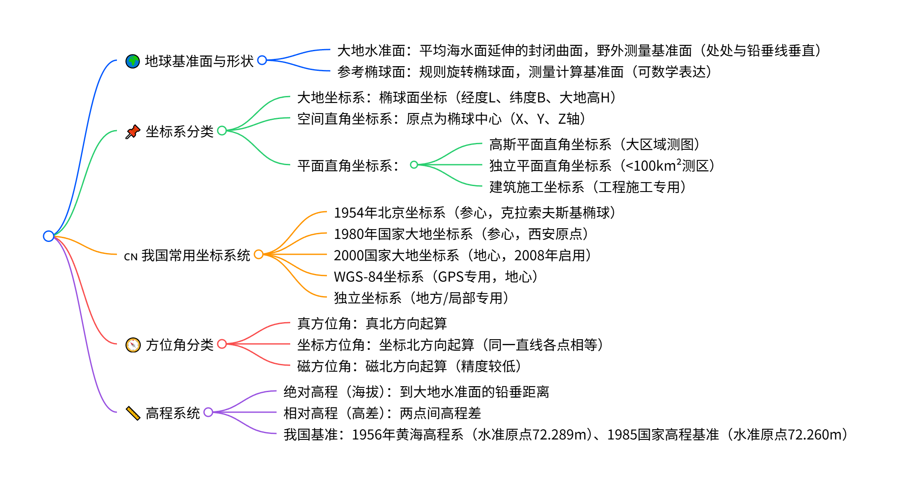
### 二、关键知识点
1. **地图投影**：
   - 核心方法：高斯-克吕格投影（横切椭圆柱等角投影），分6°带（<1:1万测图）和3°带（≥1:1万测图），限制长度变形。
   - 关键操作：距离改化（球面距离→投影面距离）、方向改化（球面角度→平面角度）、邻带坐标换算（不同投影带坐标统一）。
2. **水平面代替水准面的限度**：
   - 距离：≤10km时，误差可忽略；
   - 水平角：≤100km²时，误差可忽略；
   - 高差：即使短距离（如1km误差8cm），必须考虑地球曲率影响。
3. **坐标换算**：大地坐标、空间直角坐标、平面直角坐标可相互转换；施工坐标系与测量坐标系需通过方位角和原点坐标换算。

## 第2章 地形图基本知识
### 一、核心概念与分类（思维导图）
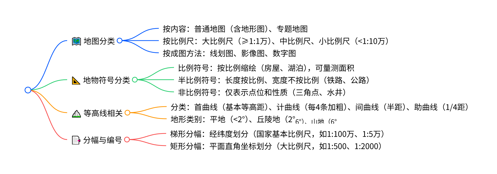

### 二、关键知识点
1. **比例尺与精度**：
   - 比例尺：图上距离与实地水平距离的比值（1/M）；
   - 比例尺精度：图上0.1mm对应的实地距离（如1:1000精度1m，1:2000精度2m），决定测图精度和比例尺选择。
2. **地形图核心内容**：
   - 数学要素：比例尺、坐标格网；
   - 地形要素：地物（固定物体）、地貌（高低起伏）；
   - 注记与整饰：地名、说明注记（房屋层数、等高线高程）、图名、图号等。
3. **地物符号定位规则**：
   - 非比例符号：单点符号取符号中心点，圆形/方形取几何中心，宽底符号取底线中心等；
   - 半比例符号：单线符号取自身中心线，对称双线取中轴线，非对称取底线/缘线。
4. **等高线特性**：同线等高、闭合曲线（悬崖除外不相交）、与分水线/合水线正交、密陡疏缓。
5. **分幅编号核心**：
   - 梯形分幅：以1:100万为基础，按经差/纬差加密（如1:100万分60带，经差6°）；
   - 矩形分幅：按整千米/百米坐标划分，编号方式有西南角坐标、流水号、行列号等。

## 第4章 水准测量
### 一、核心概念与分类（思维导图）
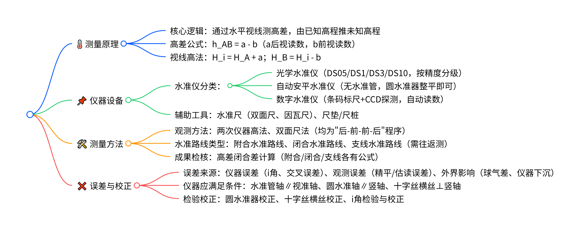
### 二、关键知识点
1. **核心原理**：水准测量的本质是测定两点间高差，通过转点传递高程，长距离需多测站连续观测，总高差为各测站高差之和（∑h = ∑a - ∑b）。
2. **球气差影响**：地球曲率与大气折光联合影响称为球气差，公式为r = (1-K)S²/(2R)（K=0.14），可通过保持前后视距离相等抵消。
3. **数字水准仪优势**：自动读数、记录存储、精度高，读数原理分相关法、几何法、相位法，配合条码标尺使用。
4. **成果整理**：需进行高差闭合差调整，附合路线f_h = ∑h - (H_B - H_A)，闭合路线f_h = ∑h，超限需重测。

## 第5章 角度测量
### 一、核心概念与分类（思维导图）
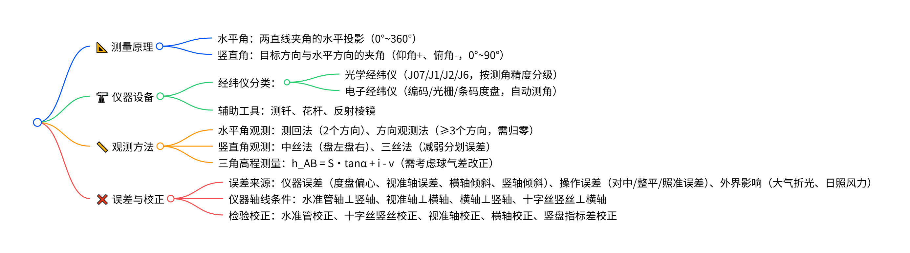

### 二、关键知识点
1. **经纬仪安置**：对中（仪器中心与测站点铅垂）、整平（竖轴竖直），方法有垂球对中、光学对中器对中、激光对中。
2. **竖盘指标差**：视线水平时竖盘读数与理论值（90°/270°）的偏差，公式x = (L + R - 360°)/2，盘左盘右观测可抵消其影响。
3. **水平角观测限差**：J6经纬仪半测回归零差≤18"，同一方向各测回较差≤24"；J2经纬仪需计算2C值，互差≤13"。
4. **三角高程测量**：远距离需考虑地球曲率、大气折光、水准面归算等改正，对向观测可削弱大气折光影响，闭合差限差W = 0.05√∑s_i²。

## 第6章 距离测量
### 一、核心概念与分类（思维导图）
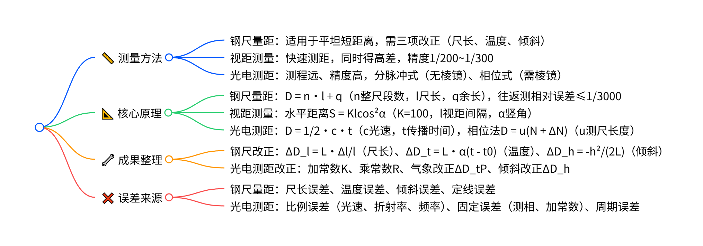
### 二、关键知识点
1. **钢尺尺长方程式**：L = L0 + ΔL + α(t - t0)L0（L0名义长度，ΔL尺长改正数，α膨胀系数）。
2. **光电测距测尺配合**：精测尺（短尺，保证精度）+ 粗测尺（长尺，保证测程），解决多值解问题。
3. **反射棱镜**：全反射棱镜保证入射光与反射光平行，适用于光电测距，有单块、三棱镜等组合。
4. **误差控制**：钢尺量距需保持拉力均匀、定线平直；光电测距需避开热源、强电磁场，精确测定气象参数。

## 第7章 全站仪测量
### 一、核心概念与分类（思维导图）
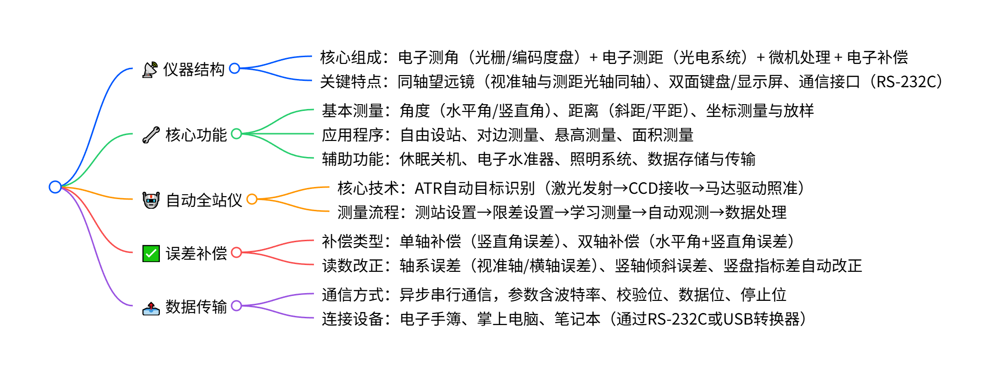
### 二、关键知识点
1. **全站仪设站**：已知点设站（输入测站/定向点坐标，照准定向）、自由设站（观测3~4个已知点，解算测站坐标）。
2. **自动全站仪照准过程**：目标搜索（马达驱动扫描）→ 目标照准（计算偏离量，驱动对准）→ 测量（改正读数，输出结果）。
3. **轴系误差补偿**：双轴补偿器探测竖轴纵向/横向倾斜量，自动改正水平度盘和垂直度盘读数，补偿精度可达0.1"。
4. **数据传输参数**：波特率（1200~38400）、校验位（无/偶/奇）、数据位（7/8）、停止位（1/2），需收发端参数一致。

## 第8章 卫星定位系统
### 一、核心概念与分类（思维导图）
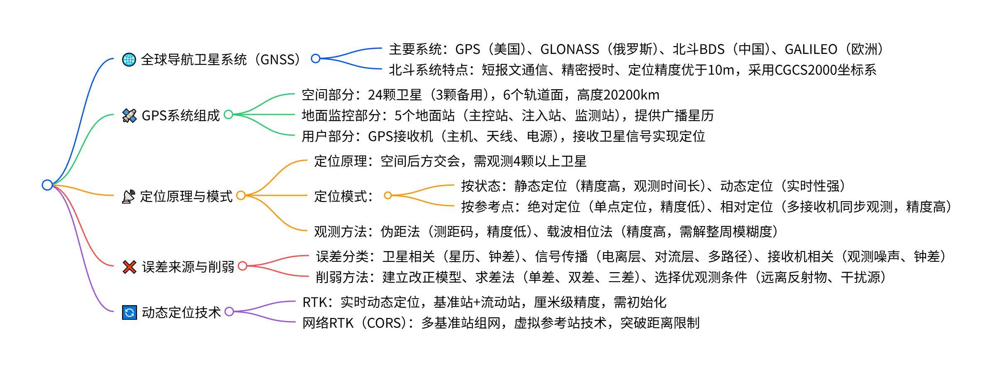
### 二、关键知识点
1. **GPS定位核心**：以卫星为已知点，通过测量站星距离，解算接收机三维坐标，采用WGS-84坐标系。
2. **载波相位测量**：精度达1-2mm，但存在整周未知数和整周跳变问题，需通过同步观测和数据处理解决。
3. **相对定位优势**：同步观测可抵消卫星钟差、电离层延迟等共同误差，大幅提高定位精度，适用于大地测量、工程测量。
4. **RTK工作流程**：基准站设站→流动站初始化→点校正→实测，坐标转换需七参数（平移、旋转、缩放）。
5. **网络RTK特点**：无需本地参考站，误差均匀，作业距离远（超15km），可靠性高，支持多用户同时作业。

## 第9章 平面控制测量
### 一、核心概念与分类（思维导图）

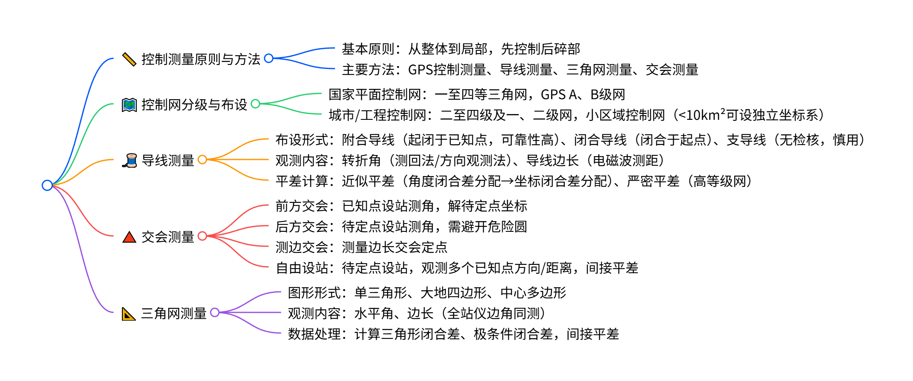
### 二、关键知识点
1. **坐标正反算**：正算（由方位角、边长求坐标）、反算（由坐标求方位角、边长），是控制网计算的基础。
2. **导线平差核心**：附合导线需计算方位角闭合差和坐标闭合差，闭合导线需计算角度闭合差，按测站数或边长比例分配改正数。
3. **交会测量注意**：前方交会交会角需30°-150°；后方交会避免待定点位于危险圆上（已知点外接圆）。
4. **GPS控制网优势**：选点灵活、无需通视、全天候作业、观测时间短，已成为控制测量主要方法。
5. **精度分析**：导线精度受测角和测边误差影响，直伸导线最弱点在中间，附合导线精度优于支导线。

## 第10章 高程控制测量
### 一、核心概念与分类（思维导图）
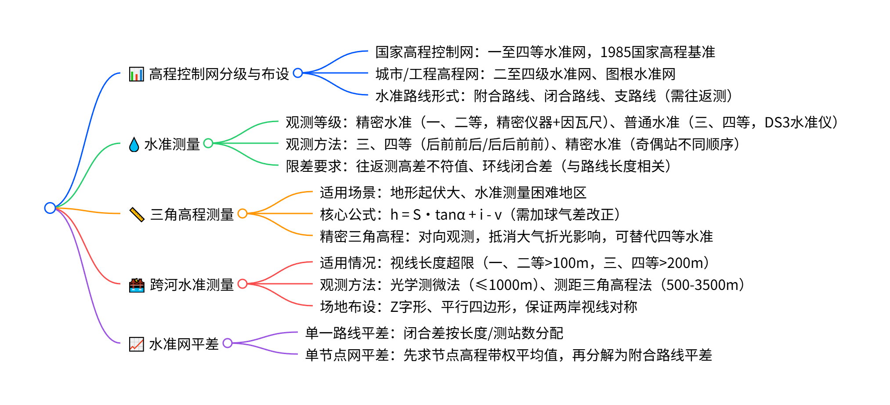

### 二、关键知识点
1. **水准测量核心**：水平视线测定高差，观测时需消除视差，控制前后视距差，精密水准需进行仪器预热、遮阳。
2. **高差闭合差计算**：附合路线f_h = Σh - (H终 - H始)，闭合路线f_h = Σh，支路线f_h = Σh往 - Σh返，超限需重测。
3. **三角高程改正**：远距离需考虑地球曲率和大气折光（球气差），对向观测可大幅削弱折光影响。
4. **跨河水准要点**：采用特制觇板提高照准精度，两岸同步观测抵消i角和折光影响，图形布设保证观测对称性。
5. **平差原则**：水准网平差遵循最小二乘原理，单一路线按比例分配闭合差，节点网需先确定节点最或然高程。

## 第11章 数字地形图成图基础
### 一、核心概念与分类（思维导图）
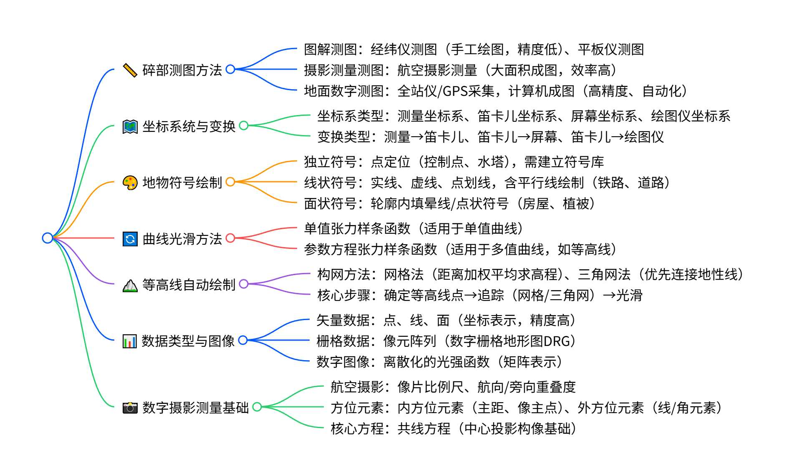

### 二、关键知识点
1. **地面数字测图特点**：精度高（电磁波测距）、自动化程度高、图根控制与碎部测量可同步（一步测图法）、不受图幅限制。
2. **坐标变换核心**：屏幕坐标系原点在左上角，需通过比例系数保持图形不变形；绘图仪坐标系以脉冲当量为单位（多为0.025mm）。
3. **曲线光滑关键**：张力系数σ决定曲线松紧，σ→0为三次样条（光滑），σ→∞为分段线性（生硬）。
4. **等高线绘制要点**：三角网构网需引入地性线（山脊线、山谷线），避免三角形穿入/悬空；等高线点通过线性内插计算，追踪时需保证闭合或衔接。
5. **数字摄影测量核心**：立体像对通过相对定向（恢复光束关系）和绝对定向（纳入地面坐标系）建立三维模型，影像匹配替代人工观测同名点。

---

## 第12章 大比例尺数字地形图测绘
### 一、核心概念与分类（思维导图）
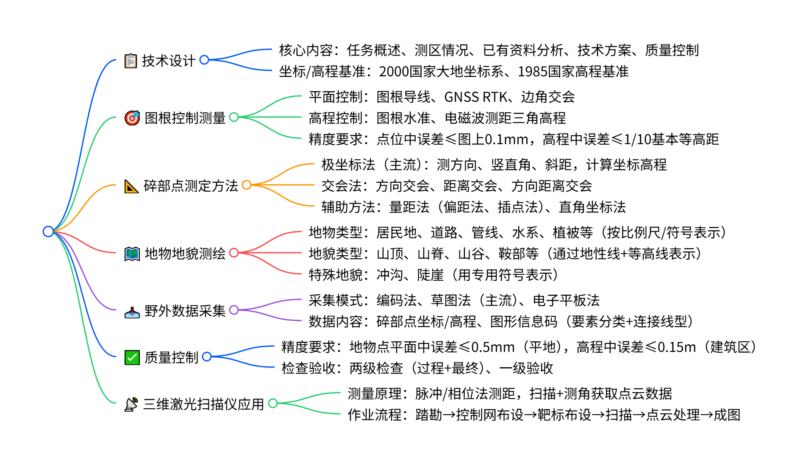

### 二、关键知识点
1. **图根控制核心**：GNSS RTK作业半径≤5km，每个点需两次独立测量；图根导线相对闭合差≤1/2000（首级）。
2. **碎部测量要点**：地物测绘需采集轮廓点/中心点，房屋凸凹≤图上0.4mm可直线连接；地貌需先测特征点，连接地性线后勾绘等高线。
3. **数据采集关键**：图形信息码由6位数字组成（大类-中类-小类-子类），连接线型分直线（1）、圆弧（2）、曲线（3）。
4. **质量检查方法**：平面精度通过外业散点法检测（20-50个点），高程精度通过高程注记点比对，边长精度通过实地量测相邻地物点间距。
5. **三维激光扫描优势**：非接触测量、采样率高（数十万点/秒）、点云数据可直接生成等高线，适用于复杂地形/危险区域。

---

## 第13章 地形图的应用
### 一、核心概念与分类（思维导图）
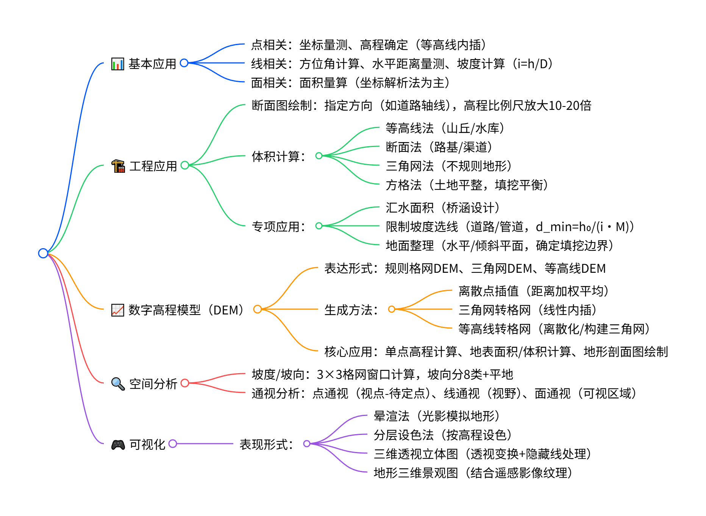
### 二、关键知识点
1. **基本应用公式**：面积量算用坐标解析法 $P=\frac{1}{2}\sum_{i=1}^{n}(x_{i}y_{i+1}-x_{i+1}y_{i})$ ；坡度计算 $i=\frac{h}{D}=\frac{h}{d\cdot M}$ （d为图上距离）。
2. **工程应用要点**：限制坡度选线需计算最小平距 $d_{min}=\frac{h_{0}}{i\cdot M}$ ；土地平整方格法需使填挖方平衡，设计高程取方格点高程平均值。
3. **DEM核心**：格网DEM分辨率决定精度，三角网DEM能保持地形特征；双线性内插可求任意点高程。
4. **通视分析原理**：通过剖面法判断，若视点与待定点连线的倾角大于所有中间点倾角，则通视。
5. **可视化关键**：三维透视立体图需确定左右消失点，处理隐藏线避免遮挡，纹理映射可结合遥感影像提升真实感。

---

## 第14章 地籍图和房产图测绘
### 一、核心概念与分类（思维导图）
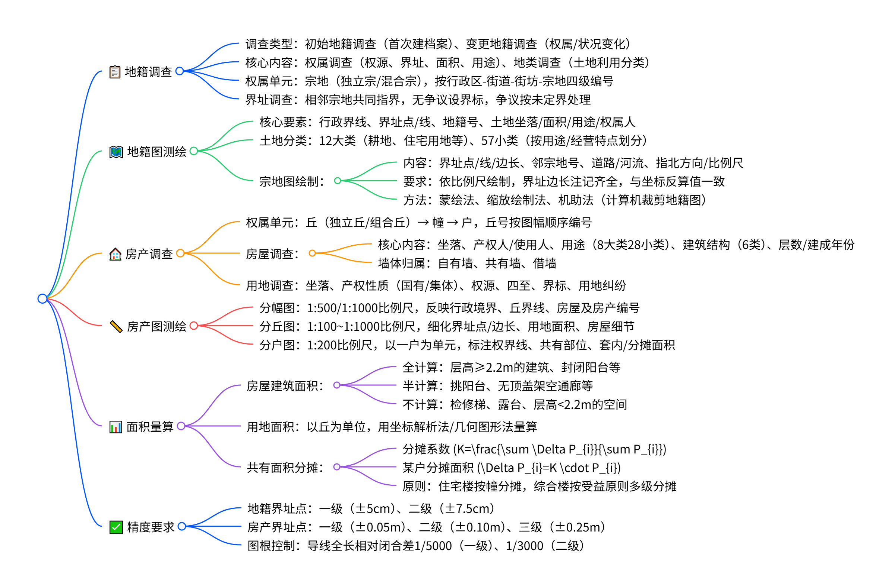
### 二、关键知识点
1. **地籍调查关键**：界址调查需相邻宗地指界人共同到场，无争议界址线设置界标；变更调查需及时更新图/档/卡/册。
2. **地籍图核心**：土地利用分类分12大类（耕地、住宅用地等）、57小类；宗地图需注记界址边长、面积、邻宗地号，具有法律效力。
3. **房产调查要点**：房屋结构分6类（钢结构→其他结构），用途分8大类（住宅、工业等）；丘号按图幅顺序编号，组合丘加支号。
4. **房产图区别**：分幅图反映整体权属状况，分丘图细化界址/边长，分户图标注套内/分摊面积（产权面积=套内+分摊）。
5. **面积量算规则**：共有面积分摊系数 $K=\frac{\sum \Delta P_{i}}{\sum P_{i}}$ ，某户分摊面积 $\Delta P_{i}=K\cdot P_{i}$ ；地下室层高≥2.2m全算面积，阳台按封闭情况半算/全算。

