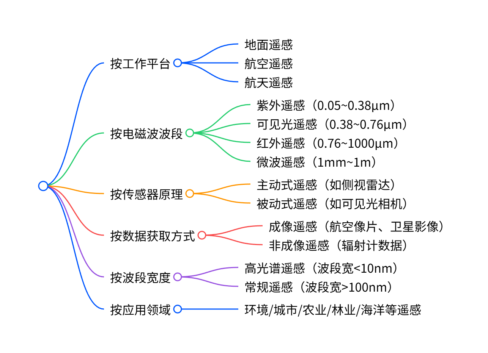
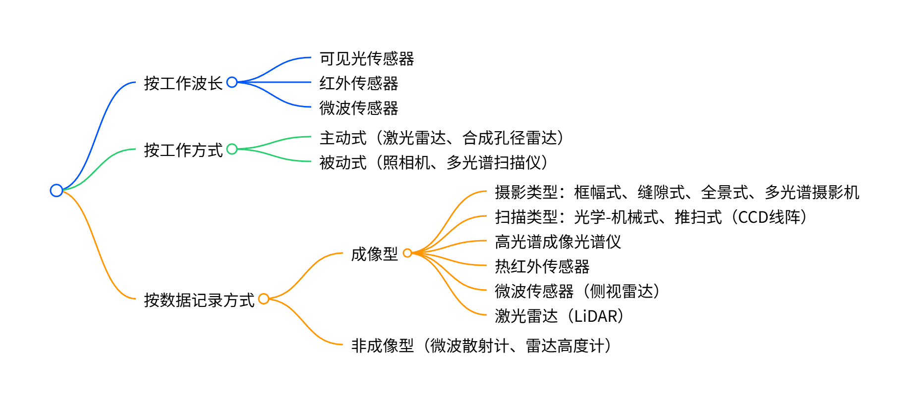
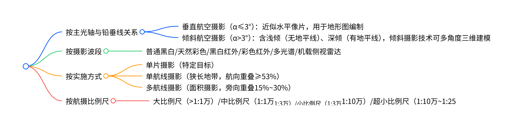
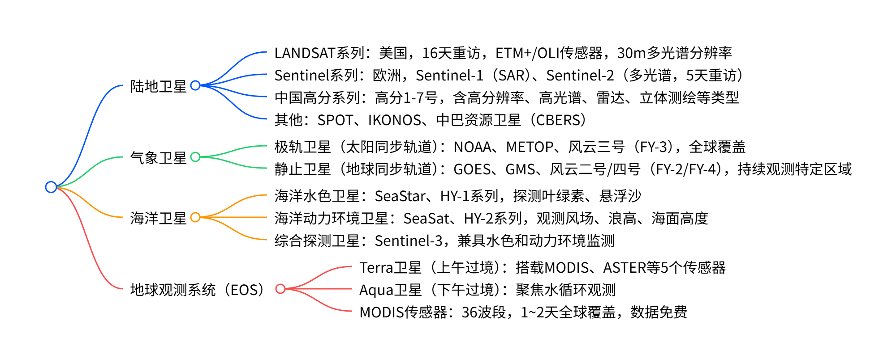
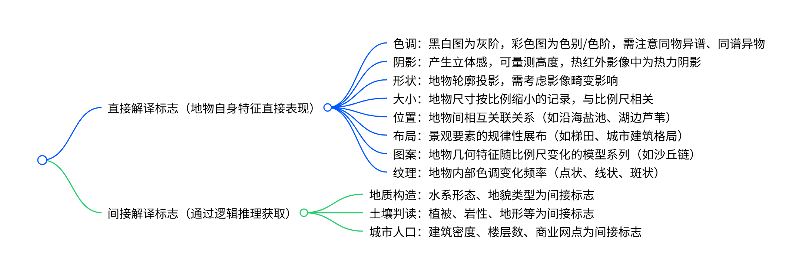
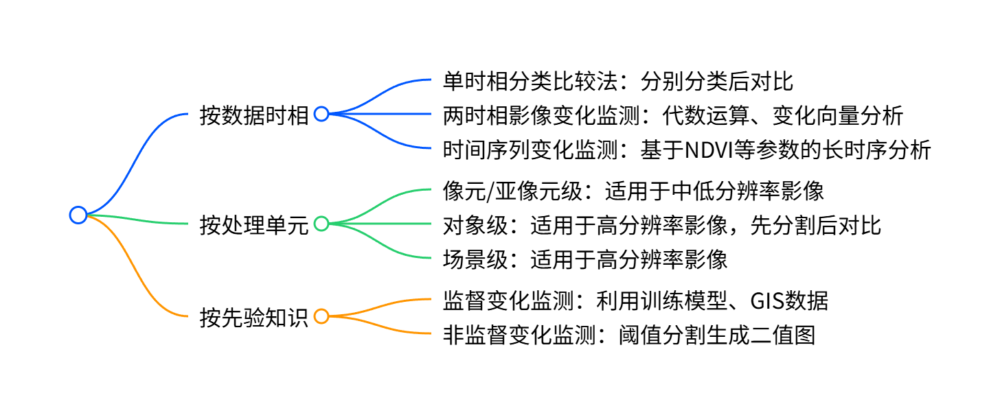

# 遥感概论知识点总结
## 第一章 概述
### 1. 遥感概念——①广②狭
- 广义：`无接触` `远距离` 通过电磁波、机械波等`探测`（含重力、磁力等物探）。
- 狭义：`不接触`目标，通过`平台`搭载的`传感器`获取目标`特征电磁波`信息，经`提取`、`处理`后`应用`的科学技术。

### 2. 遥感过程——获传预分用
完整流程：信息获取（传感器接收电磁波）→ 传输（卫星至地面站）→ 预处理（辐射/几何校正）→ 分析解译 → 实际应用（如灾害监测、资源调查）。

### 3. 传感器
- 定义：接收目标反射/辐射电磁波的装置（如照相机、扫描仪）。
- 分类（按结构原理）：摄影型、扫描成像型、雷达成像型、非图像型。

### 4. 遥感平台
- 分类（按飞行高度）：
  - 近地平台：三脚架、遥感车等，用于近距离观测。
  - 航空平台：飞机、气球等，高度<20km，如低空无人机、高空侦察机。
  - 航天平台：卫星、航天飞机等，高度>80km，覆盖范围广。

### 5. 遥感探测特点——①大②短③多④广
- 宏观观测：覆盖范围大（如TM影像覆盖34225km²）。
- 动态监测：周期短（如NOAA卫星每天覆盖全球2次）。
- 手段多样：多波段探测，可获取海量信息。
- 应用广泛：跨资源、环境、城市规划等多领域，经济效益高（美国陆地卫星投入产出比1:80）。

### 6. 遥感分类（思维导图）①平台②传感器③波段波长④波段宽度⑤有无成像⑥应用环城农林地气海军

### 7. 现代发展趋势——①分辨率↑②传感器↑③综合应用④商业化
- 多分辨率提升：空间、时间、光谱分辨率全面提高（如WorldView-2空间分辨率0.5m）。
- 新型传感器涌现：微波、高光谱遥感快速发展，激光雷达、干涉雷达应用拓展。
- 综合应用深化：RS与GIS、GNSS（3S）融合，从定性分析向定量分析转变。
- 商业化加速：民营资本参与，商业卫星（如“吉林一号”）组网，应用大众化。

---

## 第二章 遥感电磁辐射基础
### 1. 核心公式——①②③
- 斯忒藩-玻尔兹曼定律： $M =\sigma T^4$ （总辐射出射度与温度4次方成正比，$\sigma=5.67×10^{-8}W·m^{-2}·K^{-4}$ ）。
- 维恩位移定律： $\lambda_{max}·T=b$ （最强辐射波长与温度成反比， $b=2.898×10^{-3}m·K$ ）。
- 基尔霍夫定律： $M=\varepsilon M_0$ （实际物体辐射=比辐射率×黑体辐射， $0<\varepsilon≤1$ ）。

### 2. 大气对太阳辐射的作用——①②③④散射①②③
- 吸收：大气分子（水、CO₂、O₃）选择性吸收特定波段（如O₃吸收紫外）。
- 散射：
  - 瑞利散射（粒子<波长）：与波长4次方成反比，影响可见光。
  - 米氏散射（粒子≈波长）：与波长2次方成反比，影响红外、云雾区。
  - 无选择性散射（粒子>波长）：与波长无关，如云层对可见光的散射。
- 反射：主要发生在云层顶部，削弱辐射强度。
- 折射：改变辐射传播方向，影响观测精度。

### 3. 大气窗口（遥感常用波段）——紫外可见红外微波
- 0.3~1.3μm（紫外-可见光-近红外）：摄影成像、卫星扫描常用。
- 1.5~1.8μm、2.0~3.5μm（近-中红外）：植物含水量、地质制图。
- 3.5~5.5μm（中红外）：物体热辐射，昼夜云图、海面温度探测。
- 8~14μm（远红外）：地物温度测量，夜间成像。
- 0.75~100cm（微波）：穿云透雾，全天候工作（如高分三号C波段）。

### 4. 地物反射光谱
- 反射率：地物反射能量占入射总能量的百分比（ $\rho≤1$ ）。
- 主要地物光谱特征：
  - 植被：可见光绿波段反射峰，近红外高反射，红外波段因含水量出现吸收谷。
  - 水体：蓝绿光波段反射强，近红外几乎全吸收（影像呈黑色）。
  - 土壤：反射曲线平滑，土质越细、有机质含量越低，反射率越高。
- 意义：通过光谱曲线差异识别地物。

### 5. 颜色混合与影像类型
- 加色法：红、绿、蓝三原色混合，用于数字影像合成。
- 减色法：黄、品红、青三原色混合，用于彩色印刷、胶片冲洗。
- 真彩色影像：按蓝、绿、红波段合成，与自然景物颜色一致。
- 假彩色影像：人为赋予波段颜色（如近红外赋红），突出特定地物（如植被呈红色）。

---

## 第三章 传感器
### 1. 传感器组成
核心四部分：收集器（透镜、天线）→ 探测器（感光胶片、CCD）→ 处理器（信号放大、调制）→ 数据记录/输出器。
- 主动式传感器额外包含电磁辐射发射部件。

### 2. 核心性能指标——空光辐
- 空间分辨率：区分地面最小单元的能力，表现为瞬时视场（IFOV）、像元大小（如15m×15m）、线对数。
- 光谱分辨率：分辨最小波长间隔，波段数越多、带宽越窄，分辨率越高。
- 辐射分辨率：区分辐射能量细微变化的能力，用灰度分级数表示（如8bit=256级）。
- 矛盾关系：空间分辨率与光谱分辨率不可兼得，需按需选择。

### 3. 传感器分类（思维导图）

### 4. 主要传感器类型特点
- 摄影型传感器：数字摄影机（CCD/CMOS）优势显著，获取速度快、兼容性好，分面阵（框幅式）和线阵（推扫式）。
- 多光谱扫描型：
  - 光学-机械式：旋转扫描镜，如LANDSAT的MSS、TM传感器。
  - 推扫式：CCD线阵，几何精度高、信噪比高，如SPOT卫星HRV传感器。
- 高光谱成像光谱仪：波段窄（<10nm）、连续，“谱像合一”，适用于矿物探测、植被化学成分分析。
- 热红外传感器：探测地物热辐射，用于温度监测（如城市热岛），需冷却设备提升灵敏度。
- 微波传感器：主动式（雷达）可全天候工作，分真实孔径（低分辨率）和合成孔径（高分辨率）侧视雷达。
- 激光雷达（LiDAR）：主动式，发射激光脉冲，获取地物三维结构信息，精度高，适用于地形测绘、森林监测。

---

## 第四章 航空遥感
### 1. 航空遥感系统
#### （1）航空遥感平台
- 气球：分低空气球（对流层，≤5km，系留式为主）和高空气球（平流层，12~40km，自由漂移），搭载简单传感器，成本低、操作简便。
- 飞机：最常用平台，分低空（≤2km）、中空（2~6km）、高空（12~30km），可灵活控制高度、速度，携带多种传感器，信息回收方便。

#### （2）航空摄影方式（思维导图）

#### （3）航空遥感特点
- 优势：空间分辨率高，适用于大比例尺详查；灵活可控，支持专题研究；是星载传感器的先行检验平台；数据获取便捷。
- 不足：受天气限制大，观测范围有限，周期性和连续性弱于航天遥感。

### 2. 航空像片的几何特征
#### （1）投影原理
- 中心投影：地面物点通过投影中心（镜头中心）与像面点连线形成，是航空像片的投影本质。
- 成像特征：点的像为点，直线的像一般为直线（过投影中心则为点），空间曲线的像一般为曲线。

#### （2）核心几何参数
- 比例尺： $1/M = f/H$ （f为物镜焦距，H为相对航高），受地形起伏影响，平坦地区近似一致。
- 特殊点线：像主点、像底点、等角点、主纵线、主横线、等比线等，用于分析像片几何变形。
- 坐标系统：分像方（像平面、像空间、像空间辅助坐标系）和物方（地面摄影测量、地面坐标系）。
- 内外方位元素：内方位元素（主距f、像主点坐标 $(x_0,y_0)$ ）；外方位元素（3个直线元素+3个角元素，描述摄影中心位置和像片姿态）。

#### （3）共线条件方程
核心公式：  
$x=-f \cdot \frac{a_1(X-X_S)+b_1(Y-Y_S)+c_1(Z-Z_S)}{a_3(X-X_S)+b_3(Y-Y_S)+c_3(Z-Z_S)}$  
$y=-f \cdot \frac{a_2(X-X_S)+b_2(Y-Y_S)+c_2(Z-Z_S)}{a_3(X-X_S)+b_3(Y-Y_S)+c_3(Z-Z_S)}$  
用于建立像点与地面点的几何关系，解算外方位元素。

### 3. 像片视差与立体测量
#### （1）像点位移
- 原因：像片倾斜（等角点处无位移，可通过纠正消除）、地形起伏（核心影响因素）。
- 地形起伏位移公式： $\delta_h = \frac{r \cdot h}{H}$ （r为像点到像主点距离，h为地面高差，H为航高）。
- 分布规律：像主点无位移；h>0时像点背离像主点，h<0时朝向；与H成反比。

#### （2）立体测量
- 左右视差：重叠像片上对应点的横坐标之差，公式： $P = \frac{f \cdot B}{H-h}$（B为摄影基线）。
- 高差计算：$h = \frac{\Delta P \cdot H}{b+\Delta P}$ （ $\Delta P$ 为视差较，b为像片基线），通过视差差异实现地形高差测量。

### 4. 无人机遥感
#### （1）核心特点
- 高时效性（1~2小时获取结果）、高分辨率（厘米/分米级）、自主性强（预设航线）、操作简便、成本低，弥补卫星和传统航空遥感不足。

#### （2）系统组成
- 无人飞行器系统：含固定翼、旋翼等类型，搭载轻质复合材料，配飞行导航与控制系统。
- 有效任务载荷：光学相机、多光谱/高光谱成像仪、激光雷达等，70%以上为光学数码相机。
- 地面保障系统：地面控制、数据传输、影像处理系统（生成DSM、DOM、DLG等产品）。

#### （3）关键技术
- 飞行设计：地面分辨率（GSD）与成图比例尺对应；飞行高度 $H = \frac{f}{a} \cdot GSD$ （a为像元大小）；航向重叠≥70%，旁向重叠≥60%。
- 数据处理：含POS数据整理、像片预处理、内定向、相对定向、绝对定向、影像匹配、空中三角测量等步骤。

---

## 第五章 航天遥感
### 1. 遥感卫星的姿态与轨道参数
#### （1）卫星姿态
- 三轴倾斜：滚动（横向摇摆）、俯仰（纵向摇摆）、偏航（偏离轨道），需同步测量以修正数据误差。
- 振动：非系统性不稳定振动，影响扫描图像质量。

#### （2）轨道参数与类型
- 核心轨道参数：开普勒6参数（轨道长半轴、偏心率、倾角等），描述轨道形状、方向和卫星位置。
- 主要轨道类型：
  - 地球同步轨道（静止轨道，高度≈35786km）：周期与地球自转一致，用于气象、通信卫星。
  - 太阳同步轨道（极轨轨道，倾角大）：同一纬度同一地方时过境，光照条件一致，适用于资源、气象卫星。

#### （3）时间分辨率
- 定义：对同一区域重复观测的最短时间间隔，分超短周期（小时级，气象卫星）、中周期（日/旬级，资源卫星）、长周期（年级，变化监测）。
- 影响因素：轨道高度、倾角、运行周期等，可通过多星组网提升分辨率。

### 2. 主要航天遥感系统（思维导图）

### 3. 重点卫星系列核心特征
#### （1）陆地卫星
- LANDSAT-8：OLI（9波段）+TIRS（2个热红外波段），空间分辨率15m（全色）/30m（多光谱）。
- 中国高分系列：高分二号（0.8m全色）、高分三号（C波段SAR）、高分五号（高光谱）、高分七号（立体测绘）。
- Sentinel-2：13个波段，含3个红边波段，幅宽290km，中纬度2~3天重访。

#### （2）气象卫星
- 风云系列：FY-3（极轨，全球观测）、FY-4（静止，14个观测通道，15分钟全圆盘扫描），实现“多星组网、统筹运行”。
- 极轨vs静止：极轨卫星覆盖全球、分辨率高；静止卫星持续观测、时间分辨率高，二者互补。

#### （3）海洋卫星
- HY-1系列（水色）：HY-1C搭载水色水温扫描仪、海岸带成像仪，空间分辨率50m（海岸带）。
- HY-2系列（动力环境）：集雷达高度计、微波散射计于一体，实现全天时、全天候探测。

#### （4）EOS系统
- Terra/Aqua：均为太阳同步轨道，16天重访，搭载的MODIS传感器是核心，36个波段覆盖可见光至红外，数据产品分0~4级，免费开放。
- MODIS核心优势：光谱范围广、更新频率高、全球免费，适用于陆地、海洋、大气综合监测。

---

## 第六章 微波遥感与激光雷达遥感
### 1. 微波遥感概述
#### （1）微波波段划分
微波波长范围为0.1mm~1m，常用波段按波长从短到长分为Ka、K、Ku、X、C、S、L、P，核心参数如下：

| 波段 | 波长范围（cm） | 频率范围（MHz） | 遥感常用性 |
|------|----------------|------------------|------------|
| Ka    | 0.75~1.1       | 40000~26500      | 较少       |
| K     | 1.1~1.67       | 26500~18000      | 较少       |
| Ku    | 1.67~2.4       | 18000~12500      | 中等       |
| X     | 2.4~3.75       | 12500~8000       | 常用       |
| C     | 3.75~7.5       | 8000~4000        | 常用（高分三号） |
| S     | 7.5~15         | 4000~2000        | 常用       |
| L     | 15~30          | 2000~1000        | 常用       |
| P     | 30~100         | 1000~300         | 极少       |

#### （2）微波遥感核心优点
- 穿云透雾：受云雾散射影响极小，不受天气限制。
- 全天候工作：主动式/被动式均不受昼夜影响，大气衰减小。
- 地表穿透性强：波长越长穿透性越好，干沙可达数十米，冰层可达百米（良导体几乎无法穿透）。
- 独特探测能力：适用于海洋动力参数、地表高程、土壤水分、冰/水识别等。

#### （3）微波辐射关键特征
- 极化：线极化（水平H、垂直V），衍生HH、VV（同极化）、HV、VH（交叉极化）4种模式，可通过多极化组合提升解译能力。
- 相干性：相干波叠加产生干涉条纹，为干涉雷达提供基础。
- 衍射与叠加：影响雷达图像纹理与亮斑形成。

### 2. 雷达系统工作原理
#### （1）侧视雷达基础
- 工作原理：发射微波脉冲，通过回波时间计算距离（ $D=\frac{c \cdot t}{2}$ ，c为光速，t为往返时间），侧视成像避免天底盲区。
- 核心分辨率：
  - 距离分辨率： $r_p=\frac{c \cdot \tau}{2 sin\theta}$ （τ为脉冲持续期，θ为视角），近距离压缩、远距离收缩。
  - 方位分辨率：真实孔径雷达 $r_a=\beta_h \cdot R$ （β_h为波束宽度，R为斜距）；合成孔径雷达（SAR） $r_a=\frac{l_i}{2}$ （l_i为天线沿航迹长度），与距离无关，精度更高。

#### （2）主要雷达类型
- 真实孔径雷达：天线实际孔径决定分辨率，需加大天线尺寸，适用于低空/短距离观测。
- 合成孔径雷达（SAR）：通过平台移动虚拟大孔径天线，方位分辨率显著提升，是航天微波遥感核心设备。
- 干涉雷达（InSAR）：利用双天线/重复轨道获取相位差，计算地表高程（ $z=h-(r+\Delta r) cos\theta$ ），差分干涉（D-InSAR）可监测地表微量形变（如沉降、滑坡）。

### 3. 侧视雷达图像特征
#### （1）几何畸变
- 斜距图像比例尺变化：近距离地物压缩、远距离拉伸，需转换为地距图像消除。
- 地形畸变：
  - 透视收缩：面向雷达的缓坡被压缩，坡度越大收缩越明显。
  - 叠掩：陡坡/高耸地物出现顶底倒置（雷达先接收顶部回波）。
  - 阴影：背坡无回波形成暗区（坡度+视角>90°时产生）。

#### （2）信息特点
- 亮度影响因素：地面粗糙度（短波对应粗糙、长波对应光滑）、极化模式、入射角、地物复介电常数（含水量越高，反射越强）。
- 亮斑效应：面目标（如草地）随机散射形成亮点暗点相间图案，可通过降低分辨率减弱；硬目标（建筑、桥梁）因角反射产生强亮斑。

### 4. 微波遥感平台
#### （1）核心卫星实例
- 高分三号（中国）：C波段SAR，12种成像模式（聚束、条带、扫描等），1m分辨率，多极化（单/双/全极化），适用于海洋、减灾、水利监测。
- RADARSAT系列（加拿大）：C波段，RADARSAT-2支持全极化，多波束选择，幅宽10~510km，分辨率0.7~100m。
- 航天飞机成像雷达（SIR-A/B/C）：L/C/X多波段，可变视角（15°~60°），为SAR技术验证奠定基础。

### 5. 激光雷达（LiDAR）
#### （1）原理与特点
- 工作原理：主动发射激光脉冲，通过回波时间获取目标三维坐标，波长为可见光/近红外，波束极窄。
- 与微波雷达区别：角分辨率、距离分辨率更高，抗干扰强，但受大气/气象影响大（雨雪雾霾无法工作），体积重量更小。

#### （2）数据与应用
- 数据特征：生成点云数据，支持多次回波（如森林冠层→树枝→地面分层测量），直接提取DEM、建筑物高度、植被参数。
- 应用场景：航空LiDAR用于地形测绘、森林资源调查；航天LiDAR（如ICESat-2）用于冰盖监测、全球植被冠层高度估算。

---

## 第七章 遥感图像校正与增强
### 1. 图像处理系统与基础
#### （1）系统构成
- 硬件：计算机（个人机/工作站/大型机）、输入设备（数字化仪、扫描仪）、输出设备（打印机、显示器）。
- 软件：系统软件（操作系统、数据库管理）、应用软件（ENVI、ERDAS、PCI等专业遥感软件）。

#### （2）核心处理内容
- 图像校正（辐射+几何）、增强处理、图像变换、信息提取；图像直方图是核心分析工具，反映灰度分布特征（暗图/亮图/低反差/高反差）。

### 2. 辐射校正
#### （1）校正目的
消除传感器误差、大气影响、噪声等导致的辐射失真，恢复地物真实反射/辐射特性。

#### （2）主要类型与方法
- 系统辐射校正：
  - 光学摄影机： $g'=g / cos\theta$ （θ为光线与主光轴夹角）。
  - 光电扫描仪：楔校准法，修正光电转换与探测器增益误差。
- 大气校正：
  - 回归分析法：利用近红外波段（受大气影响小）与待校正波段回归，消除大气附加辐射（ $B_i'=B_i - a_i$ ， $a_i$ 为回归截距）。
  - 直方图校正法：以深水体等灰度为零的地物为基准，消除直方图漂移量。
- 噪声消除：针对高频干扰（如传感器噪声、胶片颗粒），采用滤波方法去除。

### 3. 几何校正
#### （1）畸变来源
- 内部误差：传感器成像几何（全景/斜距投影）、结构缺陷。
- 外部误差：平台姿态变化、地球自转/曲率、地形起伏、大气折光。

#### （2）校正流程与方法
- 核心方法：多项式纠正法（回避成像几何，直接模拟变形，常用二次多项式）。
- 坐标变换：直接法（原始图像→纠正后图像）、间接法（纠正后图像→原始图像，应用更广）。
- 重采样：解决校正后像元灰度赋值问题，方法对比：

| 重采样方法 | 原理 | 优点 | 缺点 |
|------------|------|------|------|
| 最近邻法 | 取最近像元灰度 | 简单快速，保持灰度不变 | 精度低，边缘锯齿状 |
| 双线性内插法 | 4邻域加权平均 | 精度中等，边缘平滑 | 计算量适中，细节略有模糊 |
| 三次卷积法 | 16邻域加权计算 | 精度高，图像平滑连续 | 计算量大，耗时较长 |

- 关键环节：地面控制点（GCP）需均匀分布、数量≥多项式系数个数，保证校正精度。

### 4. 图像增强处理
#### （1）彩色增强
- 假彩色合成：选取3个多光谱波段，按RGB通道组合（如近红外→红、红光→绿、绿光→蓝为标准假彩色），突出地物差异（如植被呈红色）。
- 密度分割：将灰度级按规则映射为彩色，提升人眼对灰度差异的识别能力。

#### （2）空间域增强
- 反差增强：
  - 线性拉伸： $g_{ij}'=k g_{ij}+b$ （k为斜率，扩展灰度范围）。
  - 非线性增强：对数增强（突出中间灰度）、指数增强（调整亮区/暗区对比度）。
  - 直方图均衡化：使灰度分布均匀，提升整体对比度；直方图匹配（按参考直方图调整，用于图像镶嵌色调统一）。
- 邻域增强：
  - 平滑滤波：3×3/5×5窗口均值/中值计算，消除噪声、模糊细节。
  - 边缘增强（锐化）：梯度法（Roberts/Prewitt/Sobel）、拉普拉斯算法，突出地物边界（如道路、河流）。
- 图像运算：四则运算（如比值运算消除地形阴影）、混合运算（归一化植被指数NDVI= $\frac{\rho_{nir}-\rho_{red}}{\rho_{nir}+\rho_{red}}$ ）。

#### （3）频率域增强
- 傅里叶变换：将空间域图像转换为频率域，低频对应均匀地物、高频对应边缘/噪声。
- 低通滤波：抑制高频、保留低频，实现图像平滑（去除噪声）。
- 高通滤波：抑制低频、保留高频，实现图像锐化（突出边缘）。

#### （4）图像变换与融合
- 主要变换：
  - K-L变换（主分量变换）：消除波段相关性，信息集中在前3个主分量，实现数据压缩。
  - K-T变换（缨帽变换）：提取亮度、绿度、湿度分量，适用于植被监测、作物估产。
- 图像融合：结合高空间分辨率（如PAN全色波段）与高光谱分辨率（多光谱波段），常用方法：主分量变换代换、HIS变换代换（用PAN波段替换I分量），提升图像细节与光谱完整性。

---
## 第八章 遥感图像解译
### 1. 目视解译原理与方法
#### （1）解译本质
目视解译是遥感成像的逆过程，通过分析影像模型（色调、灰阶、图形等），结合专业知识还原地表真实景观，核心是建立影像特征与地物属性的对应关系。

#### （2）解译标志（思维导图）

### 2. 计算机分类基本原理
#### （1）核心逻辑
基于同类地物光谱相似性、异类地物光谱差异性，将多波段影像中每个像元视为n维特征空间的点，通过统计、运算划分点群（光谱类别），再归并为实际需求的信息类别。

#### （2）分类一般步骤
1. 分类预处理：辐射校正、几何校正，消除干扰因素。
2. 特征选择：通过K-L变换、K-T变换等提取关键波段，减少冗余。
3. 分类：选择非监督/监督/机器学习等方法。
4. 分类后处理：平滑滤波去除类别噪声。
5. 专题图制作：设计投影、比例尺、图例等。

### 3. 统计模型分类方法
#### （1）非监督分类（无先验知识）
- K-mean方法：选择初始聚类中心，按距离最小原则归类，迭代更新中心至稳定，缺点是初始中心和类别数影响结果。
- ISODATA方法：K-mean改进版，支持类别合并（中心过近、样本过少）和分裂（样本过多、离散度大），动态调整类别数。
- 核心统计量：欧氏距离、绝对距离、马氏距离（克服波段相关性）、相似系数、相关系数。

#### （2）监督分类（有先验知识）
- 最小距离法：假设地物光谱呈正态分布，按像元到类中心距离归类，方法简单但未考虑样本方差。
- 最大似然比分类：基于贝叶斯准则，最小化分类错误概率，考虑均值、协方差矩阵，精度较高，应用广泛。

### 4. 机器学习分类方法
#### （1）决策树
- 结构：根节点→分支节点→叶节点，层层过滤分类。
- 核心：通过Bhattacharyya距离准则选择最优特征，剪枝优化模型，代表算法有ID3、C4.5、C5.0。

#### （2）随机森林
- 原理：集成多个决策树，通过Bagging抽样生成训练集，随机选择特征构建每棵树，最终投票决定分类结果。
- 优势：抗噪声、对高维数据友好，并行性强。

#### （3）支持向量机（SVM）
- 核心：寻找最优分类超平面，最大化类间间隔，线性不可分时通过核函数（如径向基核）映射至高维空间。
- 适用场景：小训练样本、高维数据分类，精度优于传统统计方法。

### 5. 神经网络与深度学习分类
#### （1）BP神经网络
- 结构：输入层（光谱数据）→隐层→输出层（分类结果）。
- 学习过程：正向传播（信息传递）+反向传播（误差修正权重），无需假设数据分布，适用于复杂特征空间。

#### （2）深度学习
- 卷积神经网络（CNN）：通过卷积层提取特征、池化层降维、全连接层分类，支持多特征融合（光谱、纹理、高程），适用于高分辨率影像分类。
- 深度信念网络（DBN）：由多个受限玻尔兹曼机（RBM）堆叠而成，用于特征提取和分类，精度显著优于浅层学习。

#### （3）其他分类
- 模糊分类：解决地物边界模糊问题（如土壤带、植被过渡带），代表方法为FUZZY-ISODATA。
- 面向对象分类：先分割影像生成均质对象（融合光谱+空间特征），再基于规则分类，克服像元级分类的“椒盐噪声”。

### 6. 分类精度评价
#### （1）核心指标（基于混淆矩阵）
- 总分类精度：正确分类样本数占总样本数的比例。
- Kappa系数：综合考虑错分、漏分误差，取值0~1，≥0.8为极好，0.6~0.8为很好。
- 条件Kappa系数：评价单一类别的分类精度。

---

## 第九章 遥感技术应用
### 1. 资源调查
#### （1）土地资源调查
- 技术流程：资料收集→数据预处理（校正、增强、融合）→建立解译标志→信息提取→面积统计→成果输出。
- 关键环节：解译标志建立（结合色调、纹理等特征），分类方法可选最大似然法、人机交互分类（精度更高，Kappa系数可达0.94）。

#### （2）森林资源调查
- 核心内容：地类判读、蓄积量估算（建立蓄积量与郁闭度、地貌、海拔等因子的模型）。
- 关键步骤：图像增强（植被指数法）→建立解译标志→目视判读/计算机分类→地面抽样验证。

### 2. 灾害监测
#### （1）洪涝灾害监测
- 数据选择：光学影像（GF-1、LANDSAT）+SAR影像（Sentinel-1），SAR可穿云透雾，全天候监测。
- 监测流程：数据预处理→水体提取（NDVI阈值法）→淹没范围计算→水深反演（结合DEM）。
- 核心原理：开放性水体呈低后向散射（暗区），受淹植被因二面角散射呈高后向散射（亮区）。

#### （2）地震灾害监测
- 灾前：热红外遥感监测“热震兆”（亮温异常），InSAR监测地表形变。
- 灾后：光学影像识别建筑损毁、道路破坏，SAR影像进行灾情评估，为应急救援提供支持。

### 3. 变化监测
#### （1）核心方法（思维导图）

#### （2）典型应用
- 城市扩展监测：采用深度学习模型（如CNN），提取新增建设用地，查全率可达80%。
- 土地利用/覆盖变化（LUCC）：分类后比较法，结合多期LANDSAT影像，分析不透水层、植被、水体等类型的转移变化。

### 4. 其他重要应用
#### （1）全球环境监测
- 核心方法：NDVI法（植被生长状态）、叶面积指数法、叶绿素监测法、水分含量监测法。
- 案例：利用NOAA/AVHRR的NDVI数据，分析1982-2006年全球植被生长趋势，发现1997年后呈减少趋势。

#### （2）高光谱遥感在植被监测中的应用
- 特点：波段窄（<10nm）、光谱连续，可区分细微光谱差异。
- 应用方向：生长长势监测（反演叶面积指数、生物量）、生理生化监测（叶绿素、氮素）、植被精确分类、作物估产。

#### （3）夜间灯光遥感
- 数据来源：DMSP/OLS、NPP-VIIRS、珞珈一号卫星。
- 核心应用：城市化监测、人口/CDP空间化估算、灾害评估（火灾）、渔业监测、能源消耗监测。
- 优势：数据量小、覆盖广、更新快，直接反映人类活动强度。

#### （4）海洋遥感监测
- 卫星类型：海洋水色卫星（HY-1系列，监测叶绿素、悬浮泥沙）、海洋动力环境卫星（HY-2系列，监测海面风速、波高）。
- 核心传感器：微波辐射计、雷达高度计、合成孔径雷达（SAR），实现全天候、全天时海洋观测。

---

